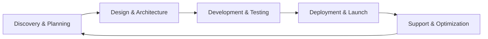

# 🚀 Bisanti Agency

> **Professional Software Development & Digital Innovation**  
> Transforming ideas into scalable, high-performance digital solutions

---

## 🎯 **About Bisanti Agency**

**Bisanti Agency** is a cutting-edge software development company specializing in **full-stack web applications**, **WordPress solutions**, and **AI-powered development tools**. We combine technical excellence with business strategy to deliver solutions that drive real results for our clients.

### **Our Mission**

To accelerate business growth through innovative software solutions, leveraging the latest technologies and development methodologies to create competitive advantages for our clients.

---

## 💼 **Our Services**

### **🌐 Full-Stack Web Development**

- **Modern Web Applications**: React, Vue.js, Angular, Next.js
- **Backend Solutions**: Node.js, PHP, Python, REST APIs
- **Database Design**: MySQL, PostgreSQL, MongoDB
- **Cloud Deployment**: AWS, Google Cloud, Azure

### **📱 WordPress Solutions**

- **Custom Plugin Development**: Tailored functionality for specific business needs
- **Theme Development**: Responsive, performance-optimized themes
- **E-commerce Solutions**: WooCommerce customization and optimization
- **Performance Optimization**: Speed and SEO improvements

### **🤖 AI & Automation**

- **AI-Powered Development Tools**: Custom solutions for team productivity
- **Process Automation**: Workflow optimization and task automation
- **Data Analytics**: Business intelligence and reporting solutions
- **Integration Services**: Third-party API connections and data synchronization

### **🔧 Technical Consulting**

- **Architecture Design**: Scalable system planning and implementation
- **Code Review & Optimization**: Performance and security improvements
- **Team Mentoring**: Developer skill enhancement and best practices
- **Technology Strategy**: Technical roadmap planning and execution

### **🖥️ IT & Managed Services**

> **TechToYou LLC** - Our specialized IT and Managed Service Provider division

- **IT Infrastructure Management**: Complete technology stack oversight and maintenance
- **Managed Service Provider (MSP)**: Comprehensive IT support for businesses
- **Cloud Solutions**: Infrastructure migration, optimization, and ongoing management
- **Security & Compliance**: Enterprise-grade security implementation and monitoring
- **Custom Enterprise Applications**: Full-service development from IT consulting to software delivery

_TechToYou LLC combines traditional IT/MSP services with custom software development, providing end-to-end technology solutions for businesses requiring both infrastructure management and specialized application development._

---

## 🛠️ **Technology Expertise**

<table>
<tr>
<td width="50%">

### **Frontend Technologies**

- ⚡ **JavaScript**: ES6+, TypeScript
- ⚛️ **Frameworks**: React, Vue.js, Angular, Next.js
- 🎨 **Styling**: CSS3, Sass, Tailwind CSS, Ant Design
- 📱 **Mobile**: Progressive Web Apps (PWAs), Flutter/Dart

</td>
<td width="50%">

### **Backend Technologies**

- 🐍 **Python**: Django, Flask, FastAPI
- 🐘 **PHP**: Laravel, WordPress, Custom APIs
- 🟢 **Node.js**: Express, NestJS, GraphQL
- 🗄️ **Databases**: MySQL, PostgreSQL, MongoDB, SQLite

</td>
</tr>
<tr>
<td width="50%">

### **DevOps & Infrastructure**

- ☁️ **Cloud Platforms**: AWS, Google Cloud, Azure
- 🐳 **Containerization**: Docker, Kubernetes
- 🔄 **CI/CD**: GitHub Actions, GitLab CI
- 📊 **Monitoring**: Analytics, Performance tracking

</td>
<td width="50%">

### **AI & Development Tools**

- 🤖 **AI Integration**: ChatGPT, Claude, Custom APIs
- 📈 **Analytics**: Git metrics, Team performance
- 🔧 **Automation**: Workflow optimization
- 📚 **Documentation**: Technical writing, API docs

</td>
</tr>
</table>

---

## 🌟 **Featured Projects & Solutions**

<table width="100%" cellpadding="0" cellspacing="0" style="border-collapse: collapse;">
<tr>
<td width="100%" style="padding: 0;">

<!-- DevGrow AI Framework Card -->

🎓

<h3 style="margin: 0; color: white; font-size: 24px; font-weight: bold;">DevGrow AI Framework</h3>

AI-Powered Developer Mentoring System

Transform any AI assistant into a senior developer mentor. Our flagship framework accelerates team growth and improves code quality through structured mentoring methodologies.

<h4 style="color: white; margin: 0 0 10px 0;">🚀 Key Features:</h4>
<ul style="color: white; margin: 0; padding-left: 20px;">
<li>🧠 AI-powered mentoring context for junior developers</li>
<li>📊 Git-based metrics and progress tracking</li>
<li>🎯 Progressive skill development framework</li>
<li>📈 65% bug reduction, 3x faster skill progression</li>
</ul>

<a href="https://github.com/Bisanti-Agency/devgrow-ai" style="background: white; color: #667eea; padding: 12px 25px; border-radius: 25px; text-decoration: none; font-weight: bold; display: inline-block; box-shadow: 0 4px 15px rgba(0,0,0,0.2);">
🔗 View DevGrow AI Framework
</a>

<!-- Manager Sedi WordPress Plugin Card -->

🏢

<h3 style="margin: 0; color: white; font-size: 24px; font-weight: bold;">Manager Sedi WordPress Plugin</h3>

Enterprise Location Management System

Custom WordPress plugin for managing multiple business locations with advanced features for data import, management, and integration.

<h4 style="color: white; margin: 0 0 10px 0;">⚡ Key Features:</h4>
<ul style="color: white; margin: 0; padding-left: 20px;">
<li>📋 XLSX data import/export functionality</li>
<li>🗺️ Multi-location management interface</li>
<li>🔄 Custom post types and meta fields</li>
<li>⚡ Performance-optimized for large datasets</li>
</ul>

🔒 Private Enterprise Solution

<!-- TTYLLC Enterprise Platform Card -->

💼

<h3 style="margin: 0; color: white; font-size: 24px; font-weight: bold;">TTYLLC Enterprise Platform</h3>

Building Inspection Management System - Complete Digital Transformation

<strong>Business Context:</strong> A comprehensive digital transformation project for a building inspection company, combining IT/MSP services with custom software development to digitize and optimize their entire inspection workflow.

<h4 style="color: white; margin: 0 0 10px 0;">🏗️ Project Scope:</h4>
<ul style="color: white; margin: 0; padding-left: 20px;">
<li>🖥️ <strong>IT Infrastructure Overhaul</strong>: Network, servers, security, and cloud migration</li>
<li>📱 <strong>Custom Application Development</strong>: Web platform, mobile app, and API backend</li>
<li>🔄 <strong>Business Process Digitization</strong>: From paper-based to fully digital workflows</li>
<li>📊 <strong>Data Management System</strong>: Centralized database with reporting and analytics</li>
</ul>

<h4 style="color: white; margin: 0 0 10px 0;">🎯 Technical Architecture:</h4>
<ul style="color: white; margin: 0; padding-left: 20px;">
<li>🐍 <strong>Django Backend</strong>: Complex relational database with inspection workflows</li>
<li>🌐 <strong>Next.js Frontend</strong>: Enterprise UI with Ant Design and real-time tracking</li>
<li>📱 <strong>Flutter Mobile</strong>: Offline-first architecture for field operations</li>
<li>🔐 <strong>Enterprise Security</strong>: Role-based access control and audit trails</li>
</ul>

<h4 style="color: white; margin: 0 0 10px 0;">📈 Results Delivered:</h4>
<ul style="color: white; margin: 0; padding-left: 20px;">
<li>✅ <strong>70% reduction</strong> in inspection processing time</li>
<li>✅ <strong>Complete elimination</strong> of paper-based processes</li>
<li>✅ <strong>Scalable system</strong> handling thousands of inspections</li>
<li>✅ <strong>Automated compliance</strong> reporting and audit trails</li>
</ul>

🔒 Enterprise Digital Transformation Project

<!-- Custom Web Applications Card -->

🌐

<h3 style="margin: 0; color: white; font-size: 24px; font-weight: bold;">Custom Web Applications</h3>

Tailored Solutions for Business Needs

We develop custom web applications that solve specific business challenges, from e-commerce platforms to internal management systems.

<h4 style="color: white; margin: 0 0 10px 0;">🛠️ Solutions Include:</h4>
<ul style="color: white; margin: 0; padding-left: 20px;">
<li>🛒 E-commerce solutions with custom functionality</li>
<li>📊 Internal dashboards and reporting systems</li>
<li>🔗 API integrations and data synchronization</li>
<li>⚡ Performance optimization and scaling</li>
</ul>

<a href="mailto:contact@bisanti.agency?subject=Custom%20Web%20Application%20Inquiry" style="background: white; color: #fa709a; padding: 12px 25px; border-radius: 25px; text-decoration: none; font-weight: bold; display: inline-block; box-shadow: 0 4px 15px rgba(0,0,0,0.2);">
💬 Discuss Your Project
</a>

</td>
</tr>
</table>

---

### **📋 TTYLLC Enterprise Platform - Technical Deep Dive**

<strong>🔍 Click to view detailed technical architecture and business logic</strong>

#### **Business Logic Deep Dive:**

The system manages complex building inspection workflows across multiple dimensions:

- **Hierarchical Organization**: Buildings belong to Communities within Regions, built by specific Builders
- **Inspection Types**: Configurable inspection categories (Foundation, Framing, Electrical, Plumbing, Final)
- **Dynamic Checklists**: Field-configurable questions with outcomes, photo requirements, and comments
- **Quality Control**: Multi-stage review process with inspector assignments and approval workflows
- **Compliance Tracking**: Automated record-keeping for regulatory compliance and reporting

#### **Detailed Technical Architecture:**

**🐍 Backend API (ttyllc-admin-v2)**: Django REST framework with Python

- Complex relational database design (Buildings → Communities → Regions → Builders)
- Inspection workflow management with dynamic checklist systems
- Role-based access control (Field Managers, Inspectors, Administrators)
- File upload and S3 storage integration for inspection photos and documents
- Multi-tenant architecture supporting different building types and inspection protocols

**🌐 Frontend Dashboard (ttyllc-admin-v2-frontend)**: Enterprise-grade Next.js application

- Next.js 14+ with TypeScript for type safety
- Ant Design (antd) component library for enterprise UI
- Redux Toolkit for state management
- Google Maps integration and Excel export capabilities
- Real-time inspection tracking and assignment management

**📱 Mobile Application (ttyllc-mobile-v2)**: Cross-platform Flutter app

- Flutter framework with Dart programming language
- Native Android/iOS capabilities for field inspectors
- Geolocation, image capture, and digital signatures
- Offline-first architecture for field operations without internet connectivity
- Barcode/QR code scanning for building identification
- Dynamic form rendering based on inspection type and building requirements

#### **Advanced Features:**

- 🔄 **Full-Stack Integration**: Seamless communication between all platform components
- 📊 **Enterprise Data Management**: Complex inspection workflows with comprehensive reporting
- 🗺️ **Geospatial Capabilities**: Location-based services, mapping, and route optimization
- 📱 **Mobile-First Field Operations**: Optimized for on-site inspections with offline capabilities
- 🔐 **Enterprise Security**: Role-based access control, audit trails, and data protection
- 📈 **Scalable Architecture**: Containerized deployment with Django migrations and database optimization
- 📋 **Configurable Workflows**: Admin-customizable inspection types, questions, and approval processes
- 🏢 **Multi-Company Support**: System designed to support multiple inspection companies or regions

_This project demonstrates our unique capability to combine traditional IT/MSP services with enterprise-grade custom software development, delivering complete business transformation solutions._

_Note: Mobile development executed through strategic partnership while maintaining Bisanti Agency technical oversight and delivery responsibility._

---

## 💡 **Why Choose Bisanti Agency?**

### **🎯 Business-Focused Approach**

- **ROI-Driven Development**: Every solution is designed to deliver measurable business value
- **Scalable Architecture**: Built for growth, from startup to enterprise
- **Performance Optimization**: Fast, efficient solutions that enhance user experience

### **🚀 Innovation & Quality**

- **Latest Technologies**: Cutting-edge tools and frameworks
- **Best Practices**: Industry-standard development methodologies
- **Continuous Learning**: Team constantly updated with latest trends

### **🤝 Partnership Approach**

- **Collaborative Process**: Close work with clients throughout development
- **Transparent Communication**: Regular updates and clear project visibility
- **Long-term Support**: Ongoing maintenance and enhancement services

### **📈 Proven Results**

- **65% Bug Reduction** in client projects using our methodologies
- **3x Faster Delivery** through optimized development processes
- **100% Client Satisfaction** with project outcomes and support

---

## 📊 **Our Development Process**

### **1. 🔍 Discovery & Planning**

- Requirements analysis and business goal alignment
- Technical architecture planning
- Project timeline and milestone definition

### **2. 🎨 Design & Architecture**

- User experience design and prototyping
- System architecture and database design
- Performance and security planning

### **3. 💻 Development & Testing**

- Agile development with regular client feedback
- Comprehensive testing (unit, integration, performance)
- Code review and quality assurance

### **4. 🚀 Deployment & Launch**

- Production deployment and configuration
- Performance monitoring setup
- User training and documentation

### **5. 🔧 Support & Optimization**

- Ongoing maintenance and updates
- Performance monitoring and optimization
- Feature enhancement and scaling

---

## 🏆 **Client Success Stories**

> _"Bisanti Agency transformed our development process. Their DevGrow AI Framework accelerated our team's growth by 300% and significantly improved our code quality."_  
> **– Tech Lead, Enterprise Software Company**

> _"The custom WordPress plugin they developed handles our complex location management needs perfectly. Outstanding technical expertise and professional service."_  
> **– Operations Manager, Multi-Location Business**

> _"Their full-stack development skills and business understanding made them the perfect partner for our web application project."_  
> **– Founder, Tech Startup**

---

## 📈 **Technologies & Tools We Use**

---

## 📞 **Get Started Today**

Ready to transform your business with innovative software solutions?

### **💬 Contact Us**

- **🌐 Website**: [bisanti.agency](https://bisanti.agency)
- **📧 Email**: [contact@bisanti.agency](mailto:contact@bisanti.agency)
- **💼 LinkedIn**: [Bisanti Agency](https://linkedin.com/company/bisanti-agency)
- **🐙 GitHub**: [github.com/Bisanti-Agency](https://github.com/Bisanti-Agency)

### **🎯 Free Consultation**

Book a **free 30-minute consultation** to discuss your project needs:

- Project requirements analysis
- Technical feasibility assessment
- Cost and timeline estimation
- Technology recommendations

### **⚡ Quick Start Options**

- **🚀 MVP Development**: Rapid prototype to market (2-4 weeks)
- **🔧 Technical Audit**: Code review and optimization recommendations
- **🎓 Team Training**: Developer mentoring and best practices workshop
- **🤖 AI Integration**: Add AI capabilities to existing applications

---

## 📚 **Resources & Documentation**

> **🚧 Content in Development**  
> We're currently building comprehensive resources for our community. Coming soon:

- **📖 Development Blog**: Technical insights and industry trends _(launching soon)_
- **🛠️ [Open Source Projects](https://github.com/Bisanti-Agency)**: Tools and frameworks for the community
- **📋 Case Studies**: Detailed project breakdowns and results _(in development)_
- **🎥 Video Tutorials**: Educational content for developers _(coming soon)_

_Stay tuned for updates on our latest content and resources!_

---

## 🌟 **Join Our Community**

Stay updated with the latest developments, get early access to new tools, and connect with other developers:

- **⭐ Star our repositories** to stay updated with new releases
- **🔔 Watch our projects** for notifications on updates
- **🤝 Contribute** to our open-source initiatives
- **💬 Join discussions** in our repository discussions

---

### **🚀 Ready to Build Something Amazing?**

**[Start Your Project](mailto:contact@bisanti.agency?subject=New%20Project%20Inquiry) | [View Our Work](https://github.com/Bisanti-Agency) | [Visit Website](https://bisanti.agency)**

---

_Made with ❤️ by Bisanti Agency - Transforming businesses through innovative software solutions_

